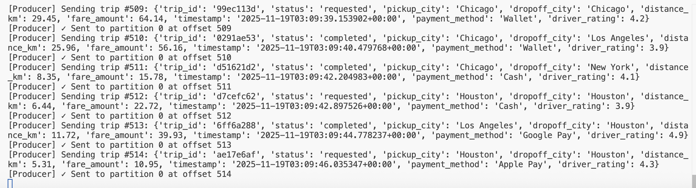
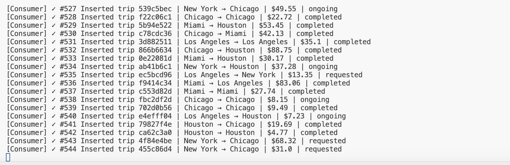
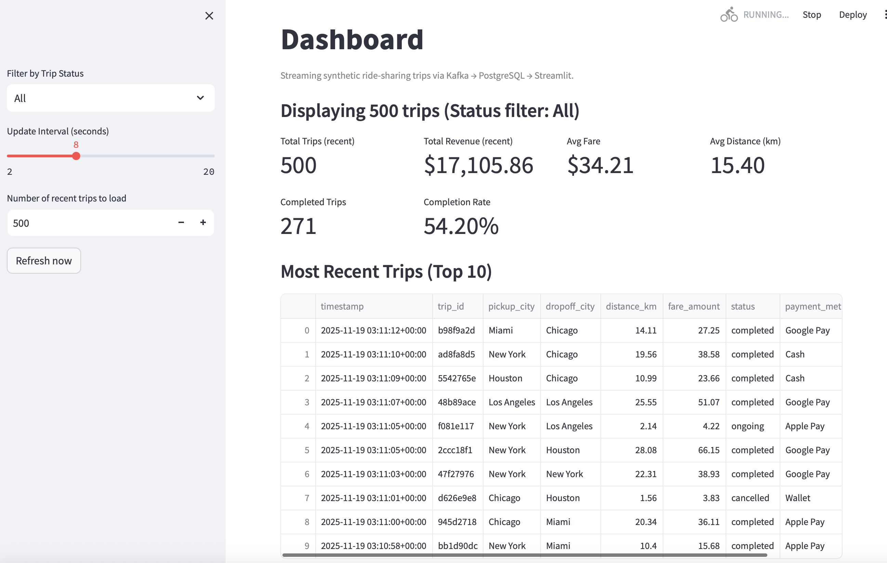

# IDS-706-week12-Assignment
Week 12 Mini Assignment: Real-Time Streaming System with Apache Kafka


# Real-Time Ride-Sharing Streaming Pipeline 🚕📡

This project implements a **real-time data streaming system** using:

- **Apache Kafka** – streaming backbone
- **PostgreSQL** – storage layer
- **Python (kafka-python, psycopg2)** – producer & consumer
- **Streamlit + Plotly** – live, auto-refreshing dashboard

It is an extended version of the class demo.  
**Domain change for assignment:** instead of generic e-commerce orders, this project models **real-time ride-sharing trips** between major cities.

---

## Overview

### What the system does

1. **Producer** simulates **ride-sharing trips**:
   - Random pickup/dropoff cities (NY, LA, Chicago, etc.)
   - Trip status (`requested`, `ongoing`, `completed`, `cancelled`)
   - Distance (km), fare, payment method, driver rating, timestamp
   - Sends JSON events to Kafka topic **`trips`**

2. **Consumer**:
   - Subscribes to Kafka topic `trips`
   - Inserts events into **PostgreSQL** table `trips`
   - Creates the table if it doesn’t exist

3. **Streamlit dashboard**:
   - Reads recent trips from Postgres
   - Refreshes in near real-time
   - Shows key metrics and charts:
     - Total trips, revenue, average fare, average distance
     - Completion rate
     - Revenue by pickup city
     - Trip counts by status
     - Recent trip table

---

## Architecture

High-level architecture:

```text
[ Python Producer ]
        |
        v
   Kafka Topic: "trips"
        |
        v
[ Python Consumer ] ---> [ PostgreSQL (trips table) ] ---> [ Streamlit Dashboard ]
```

## Structure
``` 
kafka_realtime_pipeline/
├── docker-compose.yml     
├── producer.py             
├── consumer.py            
├── dashboard.py  
├── Screenshots
    ├── Streaming1.png
    ├── Streaming2.png
    ├── Streaming3.png     
├── requirements.txt        
└── .venv/
```


## Setup

### 1 Clone project (if needed)
```
cd ~/Desktop
# git clone <your-repo-url>
cd IDS-706-week12-Assignment/kafka_realtime_pipeline
```
### 2 Create and activate virtual environment (Python 3.11)

```
python3.11 -m venv .venv
source .venv/bin/activate

python -V
```

### 3 Install Python dependencies

Make sure requirements.txt includes:
```
kafka-python==2.0.2
faker==19.3.1
psycopg2-binary==2.9.7
streamlit
sqlalchemy
pandas
plotly
```

Then install:
```
python -m pip install --upgrade pip
python -m pip install -r requirements.txt
```

## Running the Pipeline

You’ll normally use three terminals (all from the project directory, all with .venv activated).

### Start infrastructure (Kafka + Postgres via Docker)
```
docker-compose up -d
docker-compose ps
```

### Run the following files in three different terminals:
```
python consumer.py

python producer.py

python -m streamlit run dashboard.py
```

## Screenshots

### Producer


### Consumer


### Dashboard

